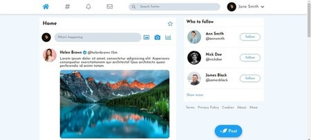

# Twitter Clone

#### A website that resambles the Twitter look and feel

#### Features
- JavScript
- HTML 
- CSS (modern flexbox and grid)

#### Livedemo
- [Twitter Clone](https://ceci007.github.io/Twitter-Clone/)

## Getting started
- git clone `this repo link`

## Author
👤 [Cecilia Benitez](https://ceciliabenitez.com/)

## Contributing

Contributions, issues and feature requests are welcome!

Feel free to check the [issues page](https://github.com/Ceci007/Twitter-Clone/issues)

## Show your support

Give a star if you like this project!

## 📝 License

This project is MIT licensed.
